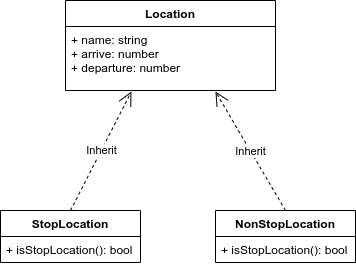

# Mandatory task to Lesson 5

In `assets/PA_0054_KT----35833A_00_2023.xml` file ([source](https://portal.cisjr.cz/pub/draha/celostatni/szdc/2023/)) you will find one train connection from Ústí nad Labem to Litvínov. Your task is to get all objects in `<CZPTTLocation>` and transfer them into object. Data what you will transfer are only `<PrimaryLocationName>` and `<Timing TimingQualifierCode="ALA"><Time>` (arrive time, is not present at first location) and `<Timing TimingQualifierCode="ALD"><Time>` (departure time, is not present at last location).

1. Architecture of object will be following. You will have parent object with location name, arrive and departure times. You will have two child objects (stop location, non-stop location) what will inherit from parent object. Both child objects will have method `isStopLocation` and will return bool. Distinguish if it is stop (arrival time is lower than departure one) or non-stop location (arrive and departure times are the same). 
2. You will prepare web application where you will have switch/radio button for selecting stop/non-stop location.
3. Beside switch/radio button you will have dropdown what will provide list of selected locations based on stop/non-stop (in step 2). If you select one location it will show details (arrival and departure times) about location.
